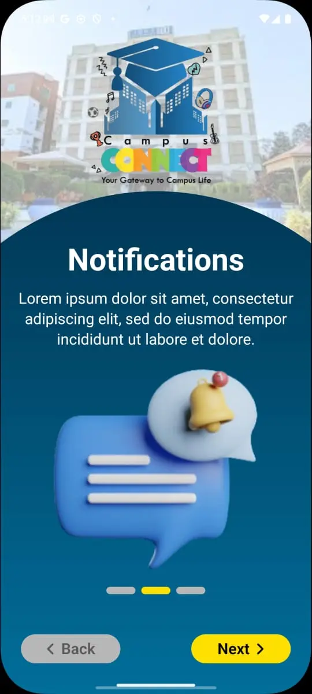
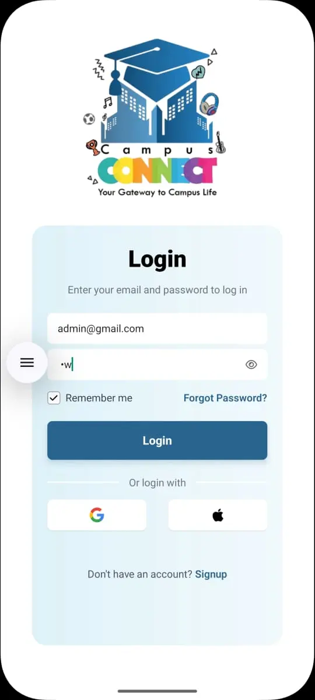
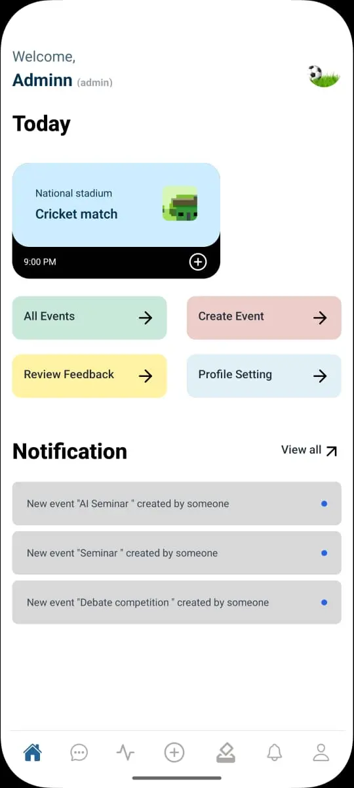
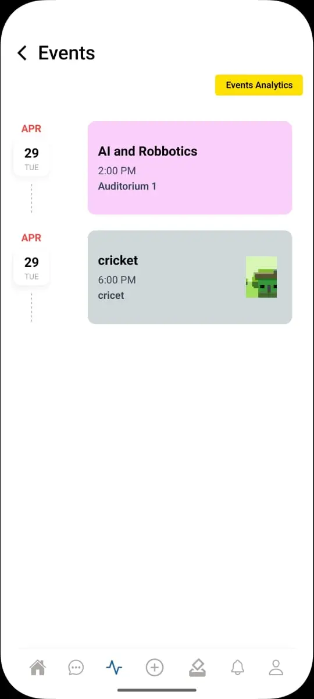
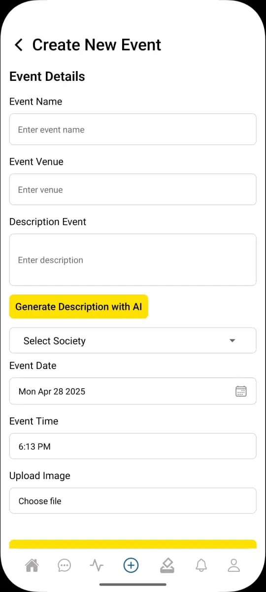
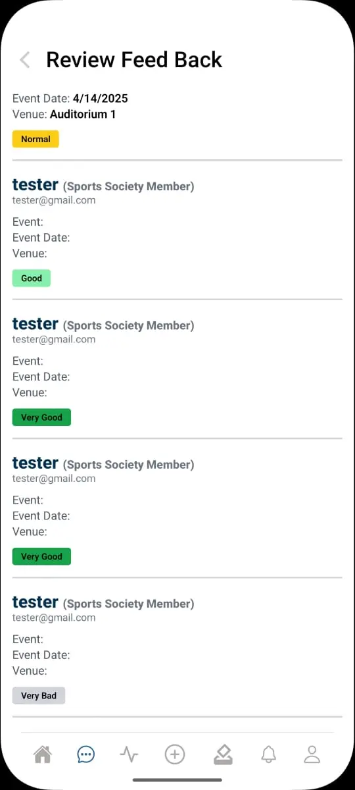

# 🎓 Campus Connect – University Societies & Events App

**Campus Connect** is a mobile-first platform built with React Native to unify all student societies within a university. It enables students to discover upcoming campus events, register online, and even participate in society elections with secure digital voting. Powered by a MERN stack backend, the app modernizes how students interact with campus life.

---

## 🎯 Purpose

Campus Connect bridges the gap between university societies and students by offering a centralized digital platform where:

- All societies can post and manage events.
- Students can explore, register, and vote in society elections.
- University life becomes more connected, transparent, and accessible.

---

## 🧠 Key Features

- 🗓 **Event Feed**  
  View upcoming events posted by various societies with filters by category, date, or popularity.

- 📝 **Event Registration**  
  One-tap event registration using a seamless mobile form and auto-filled student data.

- 🗳 **Online Voting**  
  Secure society elections with OTP/email-based verification to prevent vote duplication.

- 👥 **Society Management**  
  Societies can manage their members, create posts, and track registrations via admin panel.

- 📣 **Push Notifications**  
  Notify students of event reminders, voting deadlines, and announcements in real time.

- 📌 **User Roles**  
  - **Student**: Register for events, vote, view results  
  - **Society Admin**: Post/manage events, manage elections  
  - **Super Admin**: Monitor all societies and activities

- 🌐 **AI-Powered Recommendations** *(optional)*  
  Suggest events based on user interests, previous registrations, and location (future scope).

---

## 📸 Screenshots

### 🏠 Intro Screen  
  


### 🔐 Login  


### 🏡 Home Screen  


### 📅 Event  


### ➕ Create Event  


### 📋 Review  


---

## 🛠 Tech Stack

| Layer         | Technology                                   |
|---------------|-----------------------------------------------|
| **Frontend**  | React Native, React Navigation                |
| **Backend**   | Node.js, Express.js                           |
| **Database**  | MongoDB (Mongoose)                            |
| **State Mgmt**| Context API / Redux (optional)                |
| **Auth**      | JWT, Email Verification (Nodemailer)          |
| **AI Logic**  | Basic event suggestion model (optional)       |
| **Others**    | Firebase (optional), Cloudinary, Expo Notifications |

---

## 🚀 How to Run Locally

### 📱 React Native Frontend

```bash```
cd campus-connect-app  
npm install  
npx react-native run-android   # For Android  
npx react-native run-ios       # For iOS (macOS only)

🌐 Node Backend (Express API)

cd campus-connect-backend  
npm install  
npm run dev

## 👨‍💻 Developed by

**Muhammad Umer Baig**  
React Native | MERN Stack Developer  
📧 [umerbaig1125@gmail.com](mailto:umerbaig1125@gmail.com)  
🌐 [Portfolio](https://my-portfolio-khaki-two-96.vercel.app/)  
💼 [LinkedIn](https://www.linkedin.com/in/umer-baig-435206126/)
